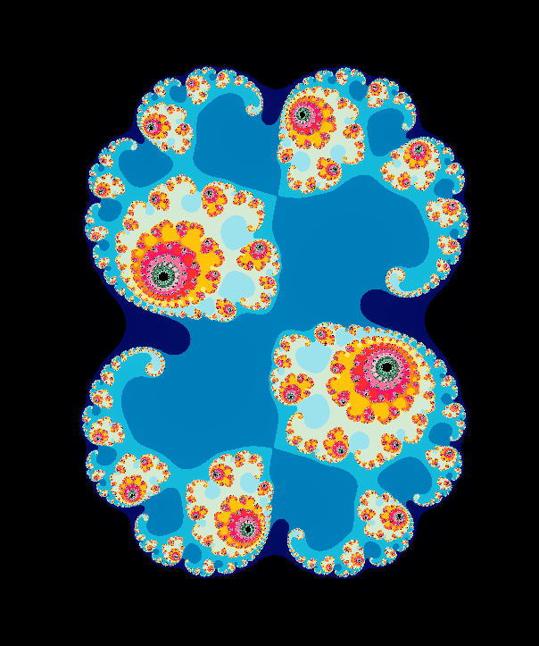

# Fractol

Fractol is a project from Ecole42 where the goal is to create Mandelbrot and Julia set fractals in C using the minilibx library.

⚠️ This is not the project i pushed, i changed 1 or 2 minor things afterhand.

## Controls

| Action        | Key                |
| ------------- | ------------------ |
| Scroll Up     | Zoom In            |
| Scroll Down   | Zoom Out           |
| Arrow Keys    | Move in the Fractal |
| 1, 2, 3(!@#)  | Change Colors      |
| numpad +      | increase max iteration|
|               | (do when you zoom)  |
| numpad -      | decrease max iteration|
|               | (do when you zoom out)|

## Launching the Project

To launch the project, use the following command:

```bash
make re && ./fractol [mandelbrot/julia/julia2/random]
```
## Screenshots
### Mandelbrot
 

### Julia
 

### Julia with diff. variables
 
